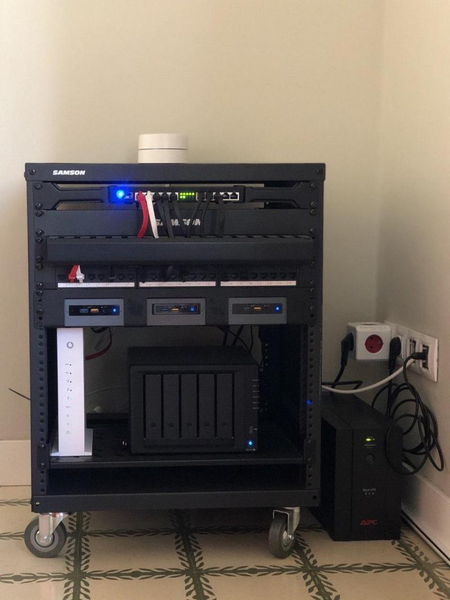

# Homelab



`Homelab` is a collection of [`nomad`](https://www.nomadproject.io/) recipes related to several Open Source projects that I use on my own `Nomad + Consul + Vault` + `Intel Nuc` cluster.

**Warning**: v2 WIP!

## ✅ Supported services

- [AlertManager](https://www.prometheus.io/docs/alerting/latest/alertmanager/): Alertmanager handles alerts sent by client applications such as the Prometheus server.
- [Bazarr](https://www.bazarr.media/): A companion application to Sonarr and Radarr. It can manage and download subtitles based on your requirements.
- [Bitwarden](https://github.com/dani-garcia/bitwarden_rs): Unofficial Bitwarden compatible server written in Rust.
- [Calibre-Web](https://github.com/janeczku/calibre-web): Web app for browsing, reading and downloading eBooks stored in a Calibre database.
- [Deluge](https://github.com/deluge-torrent/deluge): Deluge BitTorrent client.
- [Emby](https://hub.docker.com/u/emby): Emby media server.
- [Grafana](https://github.com/grafana/grafana): The open and composable observability and data visualization platform. Visualize metrics, logs, and traces from multiple sources like Prometheus, Loki, Elasticsearch, InfluxDB, Postgres and many more.
- [Guacamole](https://guacamole.apache.org/): Apache Guacamole is a clientless remote desktop gateway. It supports standard protocols like VNC, RDP, and SSH.
- [Heimdall](https://github.com/linuxserver/Heimdall): An Application dashboard and launcher.
- [IPFS](https://github.com/ipfs/ipfs): Peer-to-peer hypermedia protocol.
- [Jackett](https://github.com/Jackett/Jackett): API Support for your favorite torrent trackers.
- [Karma](https://github.com/prymitive/karma): Alert dashboard for Prometheus Alertmanager.
- [Loki](https://github.com/grafana/loki): Like Prometheus, but for logs.
- [Medusa](https://github.com/pymedusa/Medusa): Automatic Video Library Manager for TV Shows. It watches for new episodes of your favorite shows, and when they are posted it does its magic.
- [Mikrotik-Exporter](https://github.com/nshttpd/mikrotik-exporter): Prometheus mikrotik device(s) exporter.
- [LazyLibrarian](https://lazylibrarian.gitlab.io/): LazyLibrarian is a program to follow authors and grab metadata for all your digital reading needs.
- [Miniflux](https://github.com/swanson/miniflux): A self-hosted, anti-social RSS reader.
- [Mylar](https://github.com/evilhero/mylar): An automated Comic Book downloader (cbr/cbz) for use with SABnzbd, NZBGet and torrents.
- [n8n](https://n8n.io/): Extendable workflow automation.
- [Nzbget](https://nzbget.net/): The most efficient usenet downloader.
- [NzbHydra2](https://github.com/theotherp/nzbhydra2/): NZBHydra 2 is a meta search for newznab indexers and torznab trackers.
- [Pgweb](https://sosedoff.github.io/pgweb/): Cross-platform client for PostgreSQL databases. 
- [PiHole](https://pi-hole.net/): Network-wide Ad Blocking.
- [Plex](https://www.plex.tv/): Plex media server.
- [Postgres](https://www.postgresql.org/): The best SQL database of the world.
- [Prometheus](https://github.com/prometheus/prometheus): The Prometheus monitoring system and time series database.
- [Radarr](https://github.com/Radarr/Radarr): A fork of Sonarr to work with movies à la Couchpotato.
- [Readarr](https://readarr.com/): Readarr is a ebook collection manager for Usenet and BitTorrent users.
- [RetroArch](https://www.retroarch.com/): RetroArch is a frontend for emulators, game engines and media players.
- [Sabnzbd](https://sabnzbd.org/): Free and easy binary newsreader.
- [Sonarr](https://github.com/Sonarr/Sonarr): Smart PVR for newsgroup and bittorrent users.
- [Traefik](https://traefik.io/): A simple to use front-end proxy.
- [Transmission](https://transmissionbt.com/): A fast, easy and free Bittorrent client.

**Note:** These services are configured towards my necessities so, make sure to review properly each service and adjust accordingly.

## Deploy a recipe

If you have your `nomad` cluster ready, to deploy a recipe:

```bash
$ make deploy-postgres // or any other supported service
```

Make sure your `.envrc` settings are pointing correctly to your `nomad` server. Other commands are available, check out the `Makefile`!

## 💻 Contribute

Feel free to send a PR to add a new service or to correct any potential mistake you may find.

## 🙌 Acknowledgements

The initial idea was inspired by the work of [perrymanuk](https://github.com/perrymanuk) in his [`hashi-homelab`](https://github.com/perrymanuk/hashi-homelab) repository.

Many thanks to [Numtide for providing counseling](https://github.com/numtide) to everything related to `nix`.

## ✍️ License

This project is licensed under the Apache 2.0 license. See [LICENSE](LICENSE) for more details.
